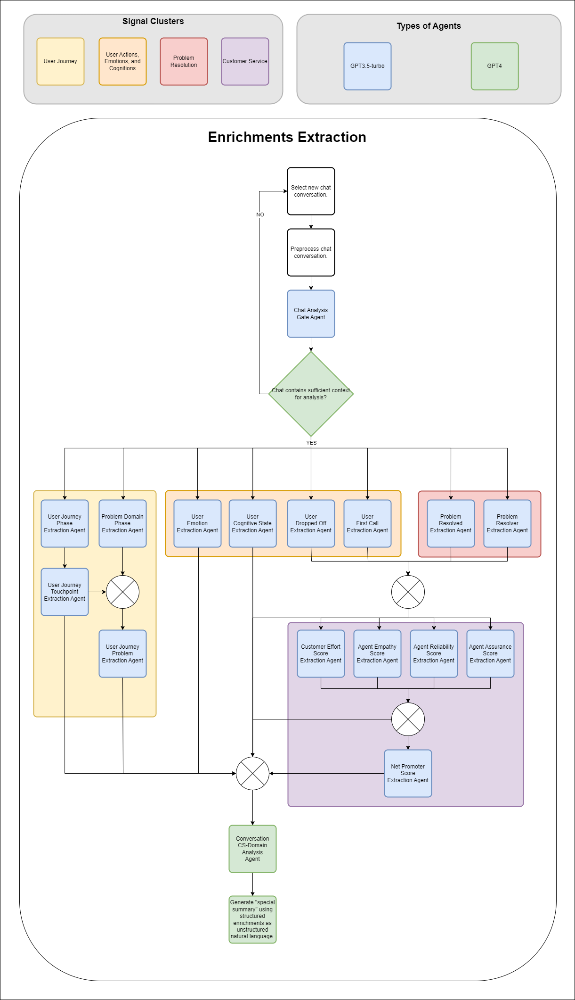
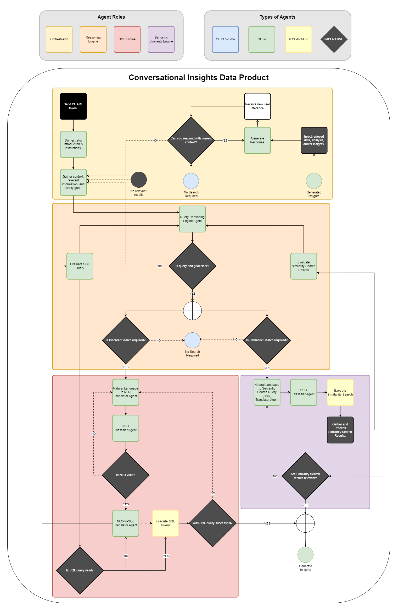
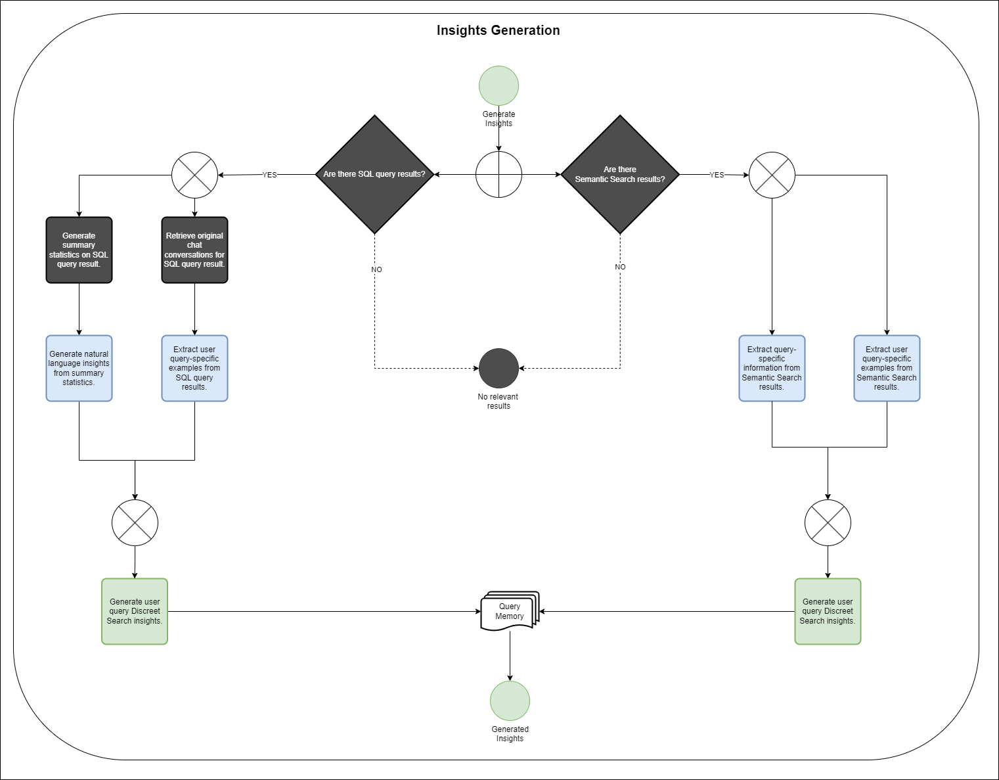

# AI-Powered CS Chat Data Insights Generation

## Table of Contents

1. Executive Summary
2. Methodology
   * Stage 1: Root Factor Analysis
     * LLM-Powered Custom Taxonomy Generation
     * LLM-Powered Feature Extraction
   * Stage 2: Conversation Sequence Analysis
     * Conversation Outcome Classification
     * Pattern Recognition Process
     * Conversation Pattern Application
   * Stage 3: CS Insights Data Product
     * Cognitive Architecture
     * Query Processing Architecture
3. User Experience & Access Patterns
   * Customer Service Agents
   * Team Leaders and Quality Assurance
   * Executive Leadership
   * Product Development Teams
4. Processing Flow
5. System Capabilities

## Executive Summary

A strategic partner approached us with a failing Customer Service (CS) system: their rule-based chatbot was resolving less than 20% of customer issues, forcing human intervention in 80% of cases. Even after human agents stepped in, resolution rates only reached 75%, with consistently poor customer satisfaction scores.

We developed an AI-powered analytics solution that transformed their raw CS chat data into actionable intelligence through three key innovations:

1. **Automated Knowledge Engineering:**
   * Inferred an automated, LLM-driven, product-specific, domain taxonomy by analysing 5,000 CS chat conversations.
   * Mapped 142 distinct customer-product touchpoints along different user journeys, across 17 specific user journey phases.
   * Structured 135 distinct problem types and root causes across 21 specific problem domains.
   * Separated and tracked both user emotional states and user cognitive states throughout chatbot conversations.
   * Inferred and mapped hierarchical relationships between journey phases, touchpoints, and problems.

2. **Advanced Pattern Recognition:**
   * Identified specific chat conversation patterns that led to successful and unsuccessful user need resolutions.
   * Used clustering to find common utterances and conversational communication patterns by users and CS agents.
   * Compressed millions of utterances into canonical versions capturing core intent.
   * Aligned sequences of canonical utterances between users and CS agents, mapping successful resolution pathways for complex customer problems.
   * Created actionable CS chat conversation playbooks for CS strategic and tactical improvements.

3. **Conversational Insights Data Product**
   * Built a conversational interface that allowed stakeholders to query and extract actionable insights from the enriched CS chat data.
   * Built a dual-database architecture combining precise SQL queries with semantic search over enriched and raw CS chat data.
   * Developed a cognitive architecture for processing and answering natural language queries about CS chat data.
   * Provided both statistical evidence and concrete conversation examples to support CS stakeholder queries.
   * Generated forward-looking, actionable recommendations for improving CS chatbot and human agent interactions, and CS strategic decision-making.

This system enables the organization to extract specific, actionable insights about their customer service operations: from identifying which touchpoints cause the most problems, to understanding which response patterns consistently lead to successful resolutions, to discovering opportunities for service automation and product improvements.

## Methodology

Our solution was developed in three sequential stages, with each stage building upon the data and capabilities established in the previous ones.

### Stage 1: Root Factor Analysis

This stage comprised two key components that worked together to transform unstructured chat conversations into structured, analysable data.

#### LLM-Powered Custom Taxonomy Generation

Rather than relying on Subject Matter Experts (SMEs) or Knowledge Engineers to manually craft taxonomies, we leveraged LLMs to inductively generate bespoke classification frameworks from the chat conversations themselves. This automated approach generated five interconnected taxonomies:

1. **Journey Phases Framework:**
   * A comprehensive mapping of 17 distinct phases in the customer journey.
   * Ranges from initial app management through to feedback collection.
   * Each phase represents a distinct stage of customer interaction with the product.

2. **Customer Touchpoints Framework:**
   * A comprehensive mapping of 142 user-product/service touchpoints across the customer journey.
   * Detailed breakdown of specific interaction points within each journey phase.
   * Example: The "App Management" phase includes touchpoints like "Download App", "Clear App Cache", "Check for Updates".
   * Enables precise tracking of where issues occur in the customer experience.

3. **Problem Domain Framework:**
   * A comprehensive mapping of 135 distinct problem issue types and root causes within 21 specific problem domain phases.
   * Hierarchical classification of issue types and their root causes.
   * Mappings between issue types and journey phases for deeper problem categorization.
   * Spans technical, product, payment, delivery, and service domains.

4. **Emotional State Framework:**
   * Implementation of the Geneva Emotion Wheel.
   * Classifies emotions across two dimensions:
     * Valence (Positive/Negative).
     * Control (High/Low).

5. **Cognitive State Framework:**
   * Similar structure to the Emotion Wheel but focuses on mental states.
   * Separates cognitive states (like confusion or clarity) from emotional responses.
   * Essential for understanding user comprehension and decision-making patterns.

#### LLM-Powered Feature Extraction

Building upon our custom taxonomies, we processed each conversation in our 5,000-conversation dataset to extract structured features across multiple dimensions:

1. **Conversational Features:**
   * **Journey Phase**: Identification of all journey phases the user went through before and during the conversation - for example, a user might have gone through "Account Setup", then "Product Query", before encountering issues during "Payment".
   * **Journey Touchpoint**: Specific touchpoints where the user interacted with the product/service - from the 142 mapped touchpoints, such as "Reset Password", "Update Payment Details", or "Track Order Status".
   * **Journey Problem**: Problems, frictions, and barriers encountered - selected from our taxonomy of 135 distinct issue types, like "Payment Gateway Errors" or "Unclear Product Specifications".
   * **Emotion**: User emotions throughout the conversation using the Geneva Emotion Wheel - tracking shifts from states like "Anger" to "Relief" or "Joy".
   * **Cognitive State**: User cognitive states during the interaction - distinguishing mental states like "Confusion" to "Clarity" from emotional responses.

2. **Resolution Metrics:**
   * **Resolved**: Whether the conversation successfully resolved the user's issue, based on explicit confirmation or clear conversation outcomes.
   * **Resolver**: If resolved, whether the solution came from the automated chatbot or required human agent intervention.
   * **First Call**: Whether this was the user's first time contacting customer service about this specific issue.
   * **Dropped Off**: Detection of conversations where users abandoned the interaction before resolution, potentially indicating severe frustration or loss of confidence.

3. **Quality Metrics:**
   * **Customer Effort Score**: (1-5 scale) measuring how much work the customer had to put in to get their issue resolved.
   * **Net Promoter Score**: (1-10 scale) indicating likelihood to recommend the service to others.
   * For conversations involving human agents:
     * **Agent Reliability Score**: (1-10) How dependably and accurately the agent delivered the promised service.
     * **Agent Assurance Score**: (1-10) How well the agent built trust and confidence.
     * **Agent Empathy Score**: (1-10) How effectively the agent demonstrated understanding and provided individualized attention.

4. **Analysis Summary:**
   * **CS Analysis**: Detailed breakdown of how the customer moved through different journey phases and touchpoints, critical analysis of the interaction between customer and service agent, highlighting effective and ineffective patterns, and practical insights about service quality, common issues, and improvement opportunities.


Figure 1: Multi-Agent Feature Extraction Pipeline

The feature extraction process follows a carefully orchestrated pipeline where specialized LLM agents work in sequence to extract increasingly complex features. First, a Gate Agent analyses the preprocessed chat to ensure sufficient context for meaningful analysis. If validated, the process branches into three parallel streams:

1. Journey-related features, where agents extract journey phases, problem domain phases, and touchpoints, which are then used to identify journey problems.
2. User state features, where separate agents identify emotions and cognitive states, alongside user status indicators like dropped-off and first-call status.
3. Resolution metrics, where agents determine if and how the problem was resolved.

These streams then feed into quality metric extraction, where agents evaluate customer effort and agent performance scores (reliability, empathy, and assurance), culminating in an NPS score.

Finally, a specialized agent performs a comprehensive analysis of the conversation, generating a detailed natural language summary that incorporates all previously extracted structured features.

### Stage 2: Conversation Sequence Analysis

Building upon the structured features extracted in Stage 1, we developed a systematic approach to identify and analyze patterns in customer service interactions. This analysis focused on understanding which conversation patterns led to different outcomes.

#### Conversation Resolution Categories

We first classified conversations into three distinct categories based on their outcomes:

1. **Great Resolutions:**
   * These conversations achieved complete problem resolution while earning top Net Promoter Scores, despite requiring significant customer effort (4-5/5 on the Customer Effort Score).
   * The high effort scores typically reflected complex, user-specific problems or edge cases that required detailed back-and-forth between customer and agent.
   * While resource-intensive, these interactions often resulted in highly loyal customers who became active promoters of the product.
   * These cases proved invaluable for understanding how to handle complex customer issues successfully.
   * The detailed resolution paths provided excellent training material for customer service agents.

2. **Simple Resolutions:**
   * These conversations resulted in successful problem resolution with top Net Promoter Scores while requiring minimal customer effort (1-3/5 on the Customer Effort Score).
   * Most issues were resolved in 2-3 chat interactions, indicating straightforward problems with well-known solutions.
   * The frequency of these interactions often highlighted basic product usability issues that could be addressed through UI/UX improvements.
   * While customers left satisfied, the need for customer service intervention for simple issues represented unnecessary operational costs.
   * These cases provided clear opportunities for automation and self-service solution development.

3. **Catastrophic Non-Resolutions:**
   * These interactions ended without resolving the customer's problem, despite significant customer effort (4-5/5 on the Customer Effort Score).
   * Customers expressed their dissatisfaction through bottom-tier Net Promoter Scores.
   * These failures often led to immediate customer churn and negative word-of-mouth, including public complaints on social media.
   * Each case represented both a significant business risk and a critical learning opportunity.
   * Analysis of these interactions revealed systemic issues in product features, service processes, or agent training.

#### Conversation Pattern Analysis

To identify patterns in customer service interactions, we developed a three-stage analysis process:

1. **Utterance Clustering:**
   * We implemented minhash-LSH clustering algorithms to identify patterns in how customers and service representatives communicated similar intentions across conversations. This approach detected both identical utterances and those that were semantically equivalent but worded differently.
   * Our analysis revealed that while individual conversations contained unique elements, there were strong patterns in how both customers articulated their problems and how service representatives responded to similar situations.
   * To focus on statistically significant patterns, we filtered out utterances that appeared only once in the dataset. This removed noise from highly specific or unusual interactions that wouldn't contribute to understanding systematic patterns.
   * For utterance clusters containing at least two near-identical sentences with a minimum occurrence frequency of two, we employed LLMs to generate a "canonical" version. This canonical version served as a prototypical utterance representing the core communicative intent of that cluster.
   * This compression technique proved highly effective, reducing hundreds of thousand of individual utterances down to several thousand representative prototypical utterances. These prototypes captured the fundamental patterns of customer-agent interactions while filtering out circumstantial variations.

2. **Conversation Reconstruction:**
   * Using our database of prototypical utterances, we systematically reconstructed each conversation by replacing specific utterances with their canonical versions. This standardization made pattern recognition possible across large numbers of conversations.
   * During reconstruction, we deliberately removed utterances that didn't map to any significant cluster. This focused our analysis on common patterns rather than one-off exchanges that, while possibly important to specific conversations, didn't represent systematic trends.
   * The reconstruction process transformed varied but similar conversations into comparable sequences of prototypical utterances, enabling us to identify common flows and patterns in customer service interactions.

3. **Sequence Analysis:**
   We implemented three complementary analytical approaches to understand conversation patterns:

   1. **Identical Sequence Analysis:**
      * We identified conversations that followed exactly the same sequence of prototypical utterances. These typically represented straightforward, script-following interactions that resolved common issues.
      * Most identical sequences were relatively short, consisting of 2-4 conversation turns. This indicated that many simple issues could be resolved through standardized response patterns.
      * These sequences provided valuable insights into which standardized approaches consistently led to successful resolution of common problems.

   2. **Near-Identical Sequence Analysis:**
      * We analysed conversations with small "edit distances" in their prototypical utterance sequences. This revealed how service representatives made minor adaptations to standard scripts while handling similar issues.
      * The analysis highlighted successful variations in problem-resolution approaches, showing how agents effectively tailored standard responses to specific customer needs.
      * These patterns proved particularly valuable for understanding how to maintain high service quality while allowing necessary flexibility in customer interactions.

   3. **"Bag-of-Words" Analysis:**
      * This approach identified conversations that contained similar sets of prototypical utterances but in different orderings. It revealed how related issues might be raised and addressed in various sequences.
      * The analysis was particularly valuable for understanding complex interactions where customers raised multiple related concerns, showing how different conversation flows could lead to successful resolution of interconnected issues.
      * This method helped identify clusters of related problems that frequently co-occurred, enabling more comprehensive problem-solving approaches.

#### Conversational Pattern Application

The sequence analysis not only revealed patterns in customer-agent interactions but also provided actionable insights for improving customer service operations. By correlating conversation patterns with outcomes, we identified specific strategies and approaches that consistently led to successful resolutions. This analysis drove immediate improvements in service protocols and laid the groundwork for future enhancements to the customer service platform.

1. **Resolution Pattern Correlation:**
   * We aggregated the outcomes (Great Resolution, Simple Resolution, or Catastrophic Non-Resolution) for conversations within each sequence pattern identified by our three analytical approaches.
   * This correlation analysis revealed which conversation patterns consistently led to successful resolutions versus those that frequently resulted in customer dissatisfaction.
   * For identical sequences, we found clear patterns in how straightforward issues could be efficiently resolved, providing a foundation for optimizing standard response protocols.
   * Near-identical sequence analysis revealed crucial decision points where slight variations in agent responses could significantly impact the conversation's outcome, highlighting opportunities for improving service scripts.
   * The bag-of-words analysis helped identify complex issue combinations that required special handling, enabling better preparation for multi-faceted customer problems.

2. **Strategic Implementation:**
   * The company's Customer Service and Marketing management used these insights to comprehensively revise their customer service protocols.
   * All customer service representative scripts were updated based on the identified successful conversation patterns.
   * The automated chatbot's response patterns were similarly refined to better align with proven successful interaction patterns.
   * This data-driven approach to script revision focused on incorporating the flexible elements that distinguished successful human agent interactions while maintaining necessary standardization.

3. **Proposed Enhancement:**
   * We developed a proposal for a dynamic suggestion system to be integrated into the customer service interface.
   * This system would analyze ongoing conversations in real-time and suggest optimal responses based on our sequence analysis.
   * Key features of the proposed system included:
     * Real-time matching of current conversation patterns against our database of successful resolution sequences.
     * Proactive identification of conversation patterns that historically led to poor outcomes.
     * Contextual suggestions for steering conversations toward proven successful resolution paths.
     * Early warning system for detecting patterns associated with potential customer churn.
   * While not implemented in this phase, this proposal represented a natural evolution of the analysis framework, moving from retrospective analysis to real-time application.

### Stage 3: Conversational Insights Data Product

The final stage of our solution transformed our rich analytical framework into an accessible business intelligence layer through a sophisticated conversational interface. This approach democratized access to deep customer service insights across the organization while maintaining the analytical rigor established in previous stages. By enabling natural language queries against our enriched conversation database, we created a system that allowed stakeholders at all levels to extract actionable insights tailored to their specific needs and responsibilities.

#### Cognitive Architecture

At the heart of our system is a cognitive architecture that transforms business questions into precise analytical insights. Rather than simply processing queries, this architecture employs multiple specialized cognitive agents that work in concert to understand intent, analyze patterns, and generate contextually relevant business intelligence. Through this sophisticated approach, we bridge the gap between raw customer service data and actionable business insights.

##### Data Storage Layer

The foundation of our cognitive architecture rests on a sophisticated dual-database system, carefully designed to enable both precise structured analysis and flexible semantic search capabilities. This hybrid approach ensures that no valuable insights are lost between the cracks of rigid categorization while maintaining the ability to perform exact quantitative analysis.

###### Relational Database (PostgreSQL)

* The system maintains a comprehensive PostgreSQL database storing enriched conversation data across multiple dimensions:
  * Customer journey phases and touchpoints.
  * Problem categories and specific issues.
  * Customer emotional and cognitive states.
  * Resolution metrics and satisfaction scores.
  * Agent performance metrics.
  * Detailed conversation summaries.
  * Original conversation text.

An example record for an enriched conversation looks like this:

  ```json
  {
      "conversation_id": "0a33e642ad814fbd94ea32f4ff55690d",
      "factors": [
          "delivery vague eta"
      ],
      "touchpoints": [
          "delivery reschedule delivery"
      ],
      "emotions": [
          "contentment",
          "relief"
      ],
      "cognitive_states": [],
      "dropped_off": false,
      "resolved": true,
      "resolver": "human",
      "first_call": true,
      "customer_effort_score": 2,
      "net_promoter_score": 10,
      "agent_reliability_score": 10,
      "agent_assurance_score": 10,
      "agent_empathy_score": 10,
      "unparsed_metadata": "Based on the chat conversation, the following analysis can be made:\n\n- Customer Problem: The customer wanted to change the delivery time of their order as they didn't know if it would arrive before they left.\n- Root Causes and Touchpoints: The root cause can be identified as `delivery vague eta` as the customer wanted to change the delivery time to avoid missing the delivery. The touchpoint can be identified as `delivery reschedule delivery` as the customer requested to reschedule the delivery time.\n- Emotions: The customer showed `contentment` and `relief` as they were satisfied with the service and their issue was resolved.\n- Service Efficacy: The customer's issue was resolved, they were served by both a bot and a human, and they remained online throughout the conversation.",
      "text": "#### CUSTOMER: Good day\n#### AGENT: Good day! How can I help you today?\n#### CUSTOMER: I'm not sure when my order will arrive. Can I change the delivery time?\n#### AGENT: Of course! Let me check the delivery details for you.\n#### AGENT: I see that the delivery is scheduled for...[TRUNCATED]"
  }
  ```

###### Vector Database

* Complementing the structured data, a vector database stores conversation summaries optimized for semantic search. This enables:
  * Semantic pattern recognition across similar conversations.
  * Contextual understanding of customer issues.
  * Quick retrieval of relevant historical cases.
* The vector database stores embedded conversation summaries, with relevant metadata, importantly the conversation ID to then retrieve the full enriched conversation from the PostgreSQL database.
* Since the sql query retrieves conversations that strictly match the query filter conditions, it can potentially leave out relevant conversations that might not match the exact filter conditions but are relevant to the query and enhance the quality of the insights generated.
* The vector database ensures that the system can enhance the pool of enriched conversations retrieved from the PostgreSQL database by including conversations that are semantically similar to the query filter conditions.

##### NLQ Verification Layer

* Each incoming query undergoes a rigorous classification process to determine:
  * Whether it's a valid analytical Natural Language Query (NLQ) about customer service data.
  * The confidence level in the classification.
* For example, a valid query looks like this (scored from 1 to 5, where 5 indicates high probability):
  * Query: "Which are the top user journey touchpoints leading to the Net Promoter Scores (NPS) beneath a score of 3?"
  * Classification:

    ```json
    {
        "nlq_probability": 5,
        "nlq_confidence": 0.95
    }
    ```

* Conversely, an invalid query classification looks like this:
  * Query: "How are you doing?"
  * Classification:

    ```json
    {
        "nlq_probability": 1,
        "nlq_confidence": 0.8
    }
    ```

##### NLQ-to-SQL Translation Layer

* For valid analytical queries, the system performs a structured translation process:
  * Converts natural language questions into precise SQL queries.
  * Ensures all necessary table joins are included.
  * Validates query structure and security constraints.

* For example:
  * Query: "Which are the top user journey touchpoints leading to the Net Promoter Scores (NPS) beneath a score of 3?"
  * SQL Translation:

    ```sql
    SELECT * 
    FROM conversation_touchpoints JOIN data_products ON conversation_touchpoints.cs_chat_id = data_products.cs_chat_id 
    WHERE net_promoter_score < 3
    ```

##### Statistical Analysis Layer

* The system performs comprehensive statistical analysis on query results:
  * Calculates proportions and distributions of categorical variables.
  * Generates summary statistics for numerical metrics.
  * Identifies significant patterns and correlations.
  * Produces aggregated views across multiple dimensions.
* For example:
  * Query: "Which are the top user journey touchpoints leading to the Net Promoter Scores (NPS) beneath a score of 3?"
  * Summary Statistics:

    ```json
    {
        "dropped_off_proportion": 0.5556,
        "resolved_proportion": 0.0,
        "first_call_proportion": 1.0,
        "resolver_proportions": {
            "bot": 0.5,
            "human": 0.5
        },
        "customer_effort_score_min": 3.0,
        "customer_effort_score_average": 4.67,
        "customer_effort_score_median": 5.0,
        "customer_effort_score_max": 5.0,
        "net_promoter_score_min": 1.0,
        "net_promoter_score_average": 1.22,
        "net_promoter_score_median": 1.0,
        "net_promoter_score_max": 2.0,
        "agent_reliability_score_min": 1.0,
        "agent_reliability_score_average": 4.0,
        "agent_reliability_score_median": 4.0,
        "agent_reliability_score_max": 7.0,
        "agent_assurance_score_min": 1.0,
        "agent_assurance_score_average": 3.5,
        "agent_assurance_score_median": 3.5,
        "agent_assurance_score_max": 6.0,
        "agent_empathy_score_min": 1.0,
        "agent_empathy_score_average": 4.0,
        "agent_empathy_score_median": 4.0,
        "agent_empathy_score_max": 7.0,
        "touchpoint_name_proportions": {
            "account create new account": 0.3333,
            "feedback submit formal complaint": 0.2222,
            "order placement confirm order": 0.1111,
            "order placement initiate checkout": 0.1111,
            "app clear app cache": 0.1111,
            "login reset password": 0.1111
        }
    }
    ```

##### Analysis Engine Layer

* The heart of the system is its analytical engine that starts transforming raw data and statistical findings into narrative analysis.
* For example:
  * Query: "Which are the top user journey touchpoints leading to the Net Promoter Scores (NPS) beneath a score of 3?"
  * Statistical Summary (using the results from the above layer):
    > The majority of users (55.56%) abruptly or prematurely ended the chat conversation, with a high proportion (100%) of chats being the customer's first call for issue resolution. The net promoter scores (NPS) were low, with a minimum score of 1.0, an average score of 1.22, and a median score of 1.0, indicating a high likelihood of customers not recommending the company. The touchpoints with the highest proportions were 'account create new account' (33.33%), 'feedback submit formal complaint' (22.22%), and 'order placement confirm order' (11.11%), while the touchpoints with the lowest proportions were 'order placement initiate checkout' (11.11%), 'app clear app cache' (11.11%), and 'login reset password' (11.11%).

##### Insights Generation Layer

* The final stage involves converting statistical findings and narrative analysis into narrative insights:
  * Generates summary statistics insights highlighting key patterns.
  * Provides detailed narrative analysis of underlying factors.
  * Offers concrete examples from relevant conversations.
  * Suggests actionable recommendations based on findings.
* For example:
  * Query: "Which are the top user journey touchpoints leading to the Net Promoter Scores (NPS) beneath a score of 3?"
  * Narrative Insight:
    > The analysis reveals a critical customer experience breakdown concentrated in the early stages of the customer journey. Account creation and formal complaints collectively account for over 55% of all low-NPS interactions, signalling fundamental issues with customer onboarding and issue resolution processes. What makes this particularly concerning is that these touchpoints represent customers' first interactions with our service – 100% of these cases were first-time support contacts, yet none achieved successful resolution. This suggests a systemic failure in our ability to convert new users into satisfied customers.
    >
    > The severity of the situation is underscored by the extreme customer effort scores, averaging 4.67 out of 5, paired with remarkably low agent performance metrics across reliability (4.0/10), assurance (3.5/10), and empathy (4.0/10). These scores indicate that customers are expending maximum effort while receiving subpar support, creating a perfect storm for customer churn. Perhaps most alarming is that over half of these customers (55.56%) abandoned their support conversations entirely, likely turning to competitors. With an average NPS of 1.22 out of 10, these experiences aren't just failing to create promoters – they're actively generating detractors who may damage brand reputation through negative word-of-mouth.
    >
    > This data points to an urgent need to transform our account creation and initial support experiences. The equal split between bot and human agent resolutions (50% each) with uniformly poor outcomes suggests that neither channel is currently equipped to handle these critical customer touchpoints effectively. By focusing immediate attention on streamlining account creation and enhancing early support interactions, we have an opportunity to convert what is currently our greatest weakness into a powerful driver of customer satisfaction and loyalty.


Figure 2: Cognitive Architecture - Multi-Agent Query Processing and Data Retrieval

The diagram illustrates the multi-layered cognitive architecture of our Conversational Insights Data Product. It shows how user queries flow through orchestration (yellow), query reasoning (orange), SQL processing (red), and semantic search (purple) layers. The process begins with an orchestrator agent that gathers context and clarifies the user's goal. A reasoning engine then determines whether the query requires structured SQL analysis, semantic search, or both. For SQL queries, a specialized pipeline validates and translates natural language to SQL, while semantic queries are processed through a parallel pipeline that finds relevant conversations. The results from both paths are combined when necessary, and finally transformed into actionable insights. Different types of LLM agents (GPT3.5-turbo, GPT4) and declarative agents handle specific tasks throughout the pipeline, as shown in the legend.


Figure 3: Insights Generation - Parallel Processing of SQL and Semantic Search Results

The diagram details how our system generates comprehensive insights by processing both structured SQL and semantic search results in parallel. For SQL query results, the system generates summary statistics and extracts relevant conversation examples that illustrate the patterns found in the data. For semantic search results, it extracts query-specific information and relevant conversation examples. Each path generates its own set of insights, which are then combined with context from the query memory to produce the final insights. This parallel processing ensures that insights are drawn from both precise statistical analysis and semantically relevant historical conversations, providing a more complete understanding of the queried topic.

## User Experience & Access Patterns

While the cognitive architecture provides the technical foundation, the true value of our system emerges in how different organizational stakeholders leverage it to extract actionable insights from their customer service operations. The conversational interface transforms complex analytical capabilities into intuitive interactions tailored to each user's role and responsibilities.

### Customer Service Agents

Customer service agents leverage real-time insights to enhance their response strategies and improve customer outcomes. The system facilitates:

#### Historical Pattern Analysis

* When handling challenging customer situations, agents can query patterns from similar historical cases:
  * Query:
    * > What are the most successful resolution patterns for delivery-related issues that achieved high Net Promoter Scores?
  * The system analyses the enriched conversation data and responds with evidence-based insights:
    * > Analysis of delivery-related conversations shows that cases achieving NPS scores of 9-10 typically involved: proactive rescheduling options (present in 82% of high-NPS cases), clear communication about delivery windows (73%), and immediate escalation to logistics teams when needed (68%). Average resolution time in these cases was 4.2 minutes.

#### Emotion-Aware Response Guidance

* Agents can query for effective strategies based on customer emotional states:
  * Query:
    * > Show me successful resolution patterns for conversations where customers initially expressed frustration during account creation.
  * The system provides targeted guidance based on analysed patterns:
    * > In conversations where customers showed initial frustration during account creation but ultimately gave high NPS scores (8-10), successful agents consistently: 1) Acknowledged the frustration explicitly, 2) Provided step-by-step guidance through specific friction points, and 3) Confirmed successful completion of each step. The average Customer Effort Score in these cases was 2.3/5.

### Team Leaders and Quality Assurance

Team leaders utilize the system to identify training opportunities and optimize team performance through systematic analysis of customer interactions:

#### Performance Pattern Analysis

* Leaders can investigate specific touchpoint performance:
  * Query:
    * > Which touchpoints in the order placement process show high resolution rates but low customer satisfaction?
  * The system provides detailed breakdowns:
    * > Analysis reveals that 'order placement confirm order' shows a 92% resolution rate but average NPS of only 6.4. Deep dive shows these interactions often involve resolved issues but high customer effort scores (average 4.2/5), primarily due to payment validation delays and session timeout issues during checkout.

#### Service Quality Optimization

* Team leaders can identify critical factors affecting service quality:
  * Query:
    * > What are the common patterns in conversations that start with payment issues and achieve high agent reliability scores?
  * Response highlights actionable patterns:
    * > In payment-related conversations with agent reliability scores above 8: 1) Agents verified payment status within first two messages (89% of cases), 2) Provided clear processing timelines (92%), 3) Offered alternative payment methods proactively (76%). These conversations show average NPS scores of 8.7 and customer effort scores of 2.1.

### Executive Leadership

Executives leverage the system for strategic insights and data-driven decision making:

#### Strategic Pattern Analysis

* Executives can identify systemic issues:
  * Query:
    * > What are the most common user journey problems associated with dropped conversations and low NPS scores?
  * The system provides executive-level insights:
    * > Analysis of conversations with NPS scores below 3 and customer drop-off reveals three primary problem domains: 1) Payment gateway errors (31% of cases), 2) Delivery timing issues (27%), 3) Account creation friction (22%). These issues show consistent patterns of high customer effort scores (average 4.6/5) and low agent reliability scores (average 4.2/10).

### Product Development Teams

Product teams utilize the conversational interface to identify pain points in existing features and uncover opportunities for new feature development through analysis of customer service interactions.

#### Feature Performance Analysis

* Product managers can investigate specific feature-related issues through targeted queries:
  * Query:
    * > What are the most frequent problems and user emotions associated with the order placement checkout process in the last month?
  * The system analyses the enriched conversation data and provides evidence-based insights:
    * > Analysis shows the touchpoint 'order placement initiate checkout' correlates strongly with the problem 'payment gateway errors' in 42% of conversations. These interactions show dominant customer emotions of 'frustration' and 'disappointment', coupled with cognitive states of 'confusion' and 'overwhelm'. The average customer effort score for these interactions is 4.2/5, with 68% of customers dropping off before resolution. Common patterns indicate users encountering session timeouts during payment validation steps, leading to incomplete transactions and requiring multiple attempts to complete orders.

#### Feature Opportunity Discovery

* Product teams can identify potential new features by analysing patterns in customer service interactions:
  * Query:
    * > What are the most requested user actions during delivery-related conversations that achieve high NPS scores?
  * The system provides actionable insights grounded in conversation analysis:
    * > In delivery-related conversations with NPS scores of 9-10, 73% of customers expressed the action 'delivery reschedule delivery' with successful resolution. These interactions show positive emotional transitions from initial 'worry' to 'relief' and 'contentment', particularly when coupled with the touchpoint 'track delivery status'. Customer cognitive states shift from 'uncertainty' to 'clarity' when agents provide specific delivery windows, suggesting an opportunity for a self-service delivery rescheduling feature integrated with real-time tracking capabilities. Average customer effort scores in these interactions are 2.1/5, indicating potential for significant effort reduction through automation.

## Processing Flow

Every interaction with our system follows a carefully orchestrated three-step process that transforms business questions into actionable insights. This systematic approach ensures consistency, reliability, and relevance in every analysis.

1. **Query Reception and Classification:**
   * Receives natural language queries from users across different organizational roles, from CS agents to executive leadership.
   * Employs sophisticated intent classification to understand the precise nature of the analytical request.
   * Evaluates query confidence levels to ensure reliable processing and accurate results.

2. **Data Retrieval and Processing:**
   * Transforms natural language questions into precise SQL queries that capture the user's analytical intent.
   * Executes optimized database queries to retrieve relevant structured data from our PostgreSQL database.
   * Identifies and retrieves representative conversation samples that illustrate key patterns and insights.
   * Queries the vector database to find semantically similar conversations, then employs an LLM-based relevance scoring system to evaluate and rank each conversation's actual relevance to the user's query.
   * Re-ranks conversations based on relevance scores and filters to include only the most pertinent ones alongside the SQL query results.
   * Conducts comprehensive statistical analysis to uncover meaningful patterns and trends in the data.

3. **Insight Generation and Delivery:**
   * Generates clear statistical summaries that highlight key findings and significant patterns.
   * Creates detailed analytical narratives that explain the implications of the data.
   * Structures insights into two distinct categories:
     * **Lagging Insights:** Derived from historical data analysis, including statistical patterns and representative chat conversations that demonstrate what has happened.
     * **Leading Insights:** Forward-looking analysis identifying emerging trends and providing actionable recommendations for service improvement.
   * Provides concrete conversation examples that illustrate successful approaches and potential pitfalls.
   * Presents all insights in a business-friendly format that supports immediate action and decision-making.

### System Capabilities

Our architecture provides three complementary analytical capabilities that together enable deep understanding of customer service operations. Each capability addresses a specific aspect of service improvement, from pattern recognition to performance measurement to root cause identification.

**Pattern Analysis:**

* Identifies common sequences in customer interactions to understand typical conversation flows and decision points.
* Reveals successful resolution patterns that can be replicated across the customer service team.
* Highlights problematic user journey paths that require immediate attention or process improvement.
* Maps emotional and cognitive state transitions to understand how customer mindsets evolve during service interactions.

**Performance Metrics:**

* Tracks resolution rates across touchpoints to identify areas of strength and opportunity in the service process.
* Infers and estimates customer satisfaction metrics to ensure service quality meets business standards.
* Evaluates agent performance indicators to support training and development initiatives.
* Monitors customer effort scores to identify opportunities for reducing service friction.

**Root Cause Analysis:**

* Identifies common problem triggers that lead customers to seek support assistance.
* Maps issue frequency across journey phases to understand where customers typically encounter difficulties.
* Analyses problem-resolution patterns to develop more effective solution strategies.
* Evaluates intervention effectiveness to continuously improve service response protocols.
